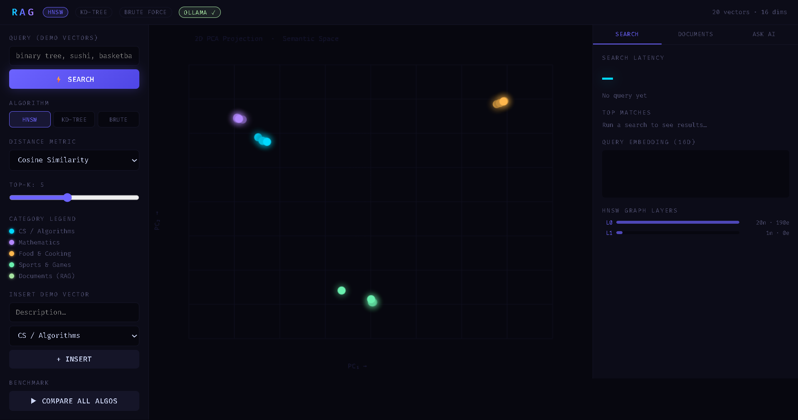

# VectorDB-CPP

Production-style semantic search and Retrieval-Augmented Generation (RAG) system built from scratch in C++ using vector embeddings, HNSW indexing, and local LLM integration.

This project explores how modern AI retrieval systems and vector databases work internally instead of relying only on managed services like Pinecone or Weaviate.

---

# Installation

## Clone the Repository

```bash
git clone https://github.com/rudra2005387/VectorDB-CPP.git
```

---

## Install Dependencies

Required:
- Git
- MSYS2 (for g++)
- Ollama

---

## Install Compiler

```bash
pacman -S mingw-w64-ucrt-x86_64-gcc
```

---

## Install Required Models

```bash
ollama pull nomic-embed-text
ollama pull llama3.2
```

---

# Run the Project

Compile:

```bash
g++ -std=c++17 -O2 main.cpp -o db -lws2_32
```

Run:

```bash
./db
```

---

# Open the Application

```text
http://localhost:8080
```

---

# Overview

VectorDB-CPP combines:
- Semantic vector search
- High-dimensional indexing
- Approximate nearest-neighbor retrieval
- Multiple search algorithms
- Retrieval-Augmented Generation (RAG)
- Local LLM inference
- REST APIs
- Document-based AI question answering

---

# Tech Stack

## Core Technologies
- C++
- HTML
- JavaScript

---

## Search Algorithms
- HNSW
- KD-Tree
- Brute Force

---

## AI & Embeddings
- Ollama
- nomic-embed-text
- llama3.2

---

## Backend APIs
- cpp-httplib

---

# Project Description

Most developers use vector databases and AI retrieval frameworks without understanding how semantic retrieval systems actually work internally.

I built this project to explore:
- How vector similarity search works
- Why HNSW is used in production retrieval systems
- ANN vs exact-search tradeoffs
- How embeddings + retrieval + LLMs form modern RAG systems
- Backend performance and indexing challenges in high-dimensional search systems

This project helped me gain hands-on experience with backend systems, vector indexing, retrieval pipelines, and AI infrastructure concepts.

---

# Features

## Semantic Search Engine
- Supports semantic similarity search across 10K+ embeddings
- High-dimensional vector indexing (768D vectors)
- Fast nearest-neighbor retrieval workflows

---

## Multiple Search Algorithms
Implemented and benchmarked:
- HNSW (Approximate Nearest Neighbor Search)
- KD-Tree Search
- Brute Force Search

---

## Distance Metrics
Supports:
- Cosine Similarity
- Euclidean Distance
- Manhattan Distance

---

## Retrieval-Augmented Generation (RAG)
Supports document-based AI question answering:
1. Convert documents into embeddings
2. Retrieve semantically relevant chunks
3. Inject retrieved context into the LLM
4. Generate grounded responses

---

## REST API Support
Backend APIs support:
- Vector insertion
- Semantic retrieval
- Benchmark testing
- Document ingestion
- RAG queries

---

## Visualization
Includes PCA-based visualization to inspect semantic clustering patterns between embeddings.

---

# System Architecture

```text
User Query / Document
          ↓
Embedding Generation (Ollama)
          ↓
768D Vector Representation
          ↓
Vector Indexing
(HNSW / KD-Tree / Brute Force)
          ↓
Top-K Semantic Retrieval
          ↓
Context Injection
          ↓
LLM Response Generation
(llama3.2)
          ↓
Final RAG Output
```

---

# How the System Works

1. User enters text or uploads documents
2. Ollama converts text into vector embeddings
3. Embeddings are indexed using HNSW / KD-Tree
4. Semantic retrieval finds relevant matches
5. Retrieved context is passed into the local LLM
6. The system generates grounded responses

---

# Example Search Queries

```text
binary tree
football
machine learning
pizza
```

---

# Example RAG Questions

```text
What is a binary search tree?
Explain how neural networks work.
Summarize the uploaded document.
```

---

# Model Usage

## Embedding Model

```text
nomic-embed-text
```

Used for generating 768-dimensional semantic vector embeddings.

---

## LLM Model

```text
llama3.2
```

Used for Retrieval-Augmented Generation and contextual response generation.

---

# Benchmark Goals

This project was used to compare:
- Exact vs approximate nearest-neighbor search
- Retrieval latency
- High-dimensional indexing performance
- Scalability tradeoffs between indexing approaches

---

# Output

The system can:
- Convert documents into semantic vector embeddings
- Retrieve contextually similar documents
- Compare multiple vector search algorithms
- Generate contextual AI responses using RAG
- Perform semantic document-based question answering
- Benchmark retrieval performance across indexing methods

---

# Notes

## Search Performance
HNSW provides significantly faster retrieval compared to brute-force search for large embedding datasets.

---

## KD-Tree Limitations
KD-Trees become less efficient in high-dimensional vector spaces compared to ANN-based approaches like HNSW.

---

## Local LLM Inference
The project uses Ollama for local inference, removing dependency on external cloud APIs.

---

## Slow Responses

Use smaller models for lower resource usage:

```bash
llama3.2:1b
```

---

## Ollama Server

If Ollama is not running:

```bash
ollama serve
```

---

# Engineering Challenges

Some of the engineering challenges explored during development:
- Efficient nearest-neighbor retrieval in high-dimensional spaces
- ANN vs exact-search tradeoffs
- HNSW graph traversal optimization
- Semantic chunk retrieval quality
- Backend API integration with local LLM inference
- Managing retrieval latency and response quality

---

# Key Learnings

Through this project I learned:
- How vector retrieval systems scale
- Why HNSW is preferred for ANN search
- Limitations of KD-Trees in high-dimensional spaces
- How RAG pipelines improve answer grounding
- Backend architecture considerations for AI systems
- Performance tradeoffs in semantic retrieval systems

---

# Project Structure

```text
VectorDB-CPP/
│
├── main.cpp
├── httplib.h
├── index.html
├── README.md
└── assets/
```

---

# Screenshots


---

# Contact & Support

If you have any questions or need support, feel free to reach out to me:

Email: rudraprataprai424@gmail.com